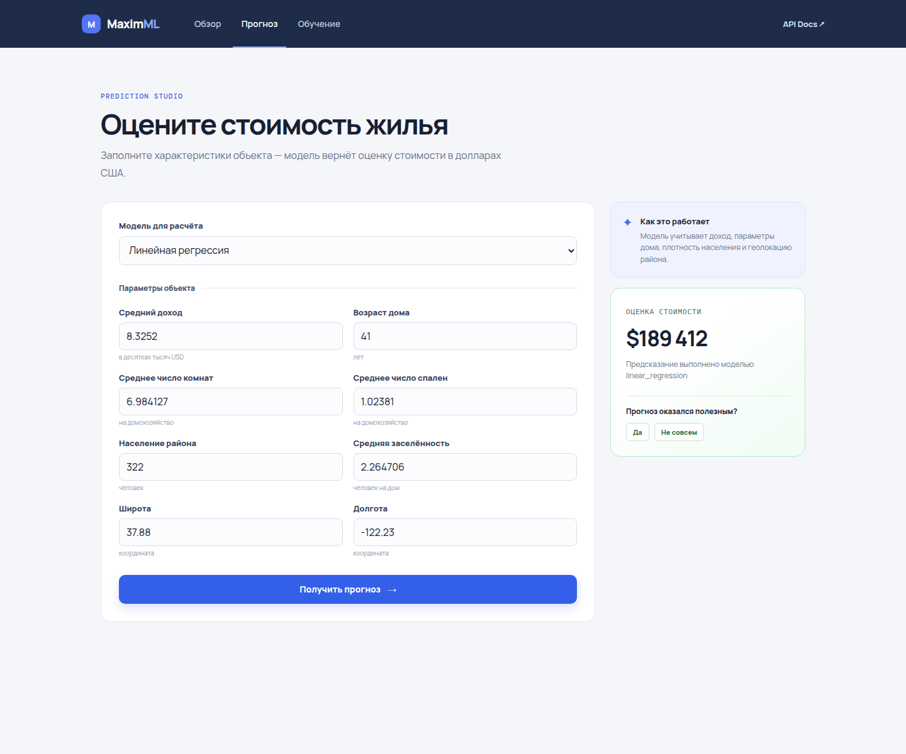
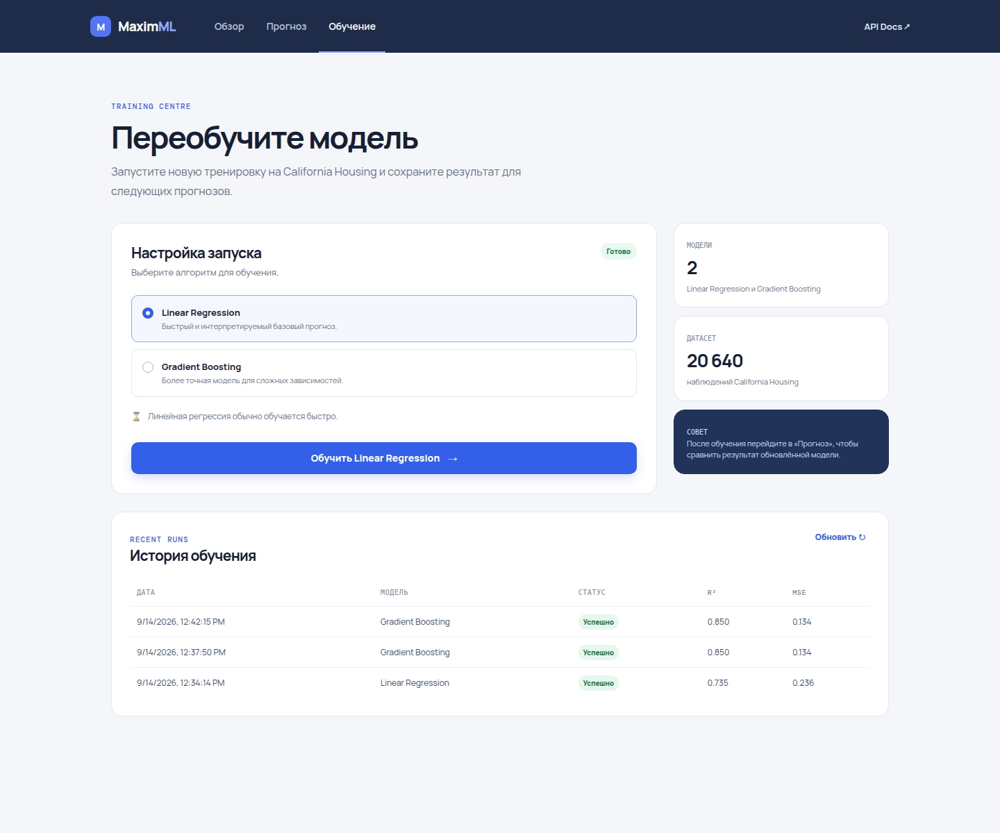

# MaximML

[](https://github.com/DanilFaritovich/maxim-ml/actions/workflows/ci.yml)
[](https://www.python.org/)
[](https://fastapi.tiangolo.com/)
[](https://www.sqlalchemy.org/)
[](https://scikit-learn.org/)
[](https://react.dev/)
[](https://www.typescriptlang.org/)
[](https://www.docker.com/)
[](LICENSE)

**MaximML** is a full-stack machine-learning application for estimating California housing prices, retraining regression models, and collecting feedback on predictions. It combines a FastAPI API, typed React interface, SQLite persistence, Docker deployment, and automated quality gates.

The project was built as a portfolio application to demonstrate an end-to-end Python ML workflow: data preparation and model persistence on the backend, a practical client interface, reproducible local deployment, and CI verification before merge.

## Interface

| Prediction workspace | Model training |
| --- | --- |
|  |  |

The [project overview](docs/images/overview.png) introduces the available models, input features, and API-backed workflow.

## What this project demonstrates

### Backend and ML engineering

- FastAPI REST API with Pydantic request and response models.
- California Housing regression workflow using Linear Regression and Gradient Boosting Regressor.
- Data preprocessing with outlier handling, scaling, and geohash-based location features.
- Server-side model training with a persisted sklearn pipeline: feature engineering, target encoding,
  and scaling are fitted only on the training split and reused unchanged by the prediction endpoint.
- SQLAlchemy 2.0 models for training history and prediction feedback.
- Structured application logging and a health-check endpoint.

### Frontend engineering

- React + TypeScript single-page application with typed Axios API clients.
- Guided housing-parameter form with model selection and prediction results.
- Training controls for both regression models and a persistent training-history view.
- Clear empty, loading, successful, and failed request states.

### Delivery and quality

- Docker Compose starts the React client, Nginx reverse proxy, FastAPI service, SQLite storage, and model volume.
- GitHub Actions runs backend quality checks, backend tests, frontend formatting, linting, type checks, tests, production build, and Docker image builds.
- Repository workflow uses `main`, `develop`, and feature branches with pull requests into `develop`.

## Tech stack

| Area | Technologies |
| --- | --- |
| Backend | Python 3.12, FastAPI, Pydantic, SQLAlchemy |
| Machine learning | scikit-learn, pandas, NumPy, category-encoders |
| Backend quality | Pytest, Ruff, Mypy |
| Frontend | React, TypeScript, Axios, Create React App |
| Frontend quality | Prettier, ESLint, TypeScript, Jest |
| Infrastructure | Docker, Docker Compose, Nginx |
| CI | GitHub Actions |
| Persistence | SQLite |

## Architecture

```text
React / TypeScript UI
        │
        │ HTTP
        ▼
Nginx reverse proxy
        │
        ▼
FastAPI routers
        │
        ├── Prediction router
        ├── Training router
        └── Feedback router
                │
                ├── ML preprocessing and training services
                ├── Saved model artifacts
                └── SQLAlchemy repositories
                        │
                        ▼
                      SQLite
```

The frontend is focused on interaction and rendering. Dataset preparation, feature engineering, inference, model training, and persistence remain backend-authoritative and independently testable.

## Key engineering decisions

- **Backend-owned ML workflow.** The browser sends parameters and commands; the API performs training, inference, artifact management, and history recording.
- **Persisted training audit trail.** Every training result, including failures and metrics, is stored in SQLite and exposed through the API.
- **Reproducible local deployment.** Docker Compose packages frontend delivery, API runtime, data storage, and model artifacts in a single command.
- **Quality gates before merge.** Static analysis and automated tests run for pull requests and updates to `develop` and `main`.
- **Typed boundaries.** Pydantic models, TypeScript interfaces, and SQLAlchemy typed mappings make data contracts explicit across the stack.

## Run the application

### Docker — recommended

Requirements:

- Docker Engine or Docker Desktop
- Docker Compose

```bash
git clone git@github.com:DanilFaritovich/maxim-ml.git
cd maxim-ml
docker compose up --build
```

Open `http://127.0.0.1:8080`.

Nginx serves the React build and proxies model, training, and feedback requests to FastAPI. SQLite data and model artifacts are kept in named Docker volumes across container recreation.

## Run for development

### Backend

Requirements: Python 3.12.

```bash
python -m venv .venv
source .venv/bin/activate  # Windows: .venv\\Scripts\\activate
pip install -r requirements.txt -r requirements-dev.txt
uvicorn main:app --reload
```

FastAPI docs: `http://127.0.0.1:8000/docs`.

### Frontend

Requirements: Node.js 20 and npm.

```bash
cd react-app
npm ci
npm start
```

The development server normally starts at `http://localhost:3000`. The backend allows the local React development origin through CORS.

## API overview

| Method | Endpoint | Purpose |
| --- | --- | --- |
| `GET` | `/health` | Service health check |
| `POST` | `/predict/{model_name}` | Predict a housing price |
| `POST` | `/train/{model_name}` | Train and persist a model |
| `GET` | `/train/history` | Return model-training history |
| `POST` | `/train_feedback/feedback` | Store feedback for a prediction |

Supported models: `linear_regression` and `gradient_boosting_regressor`.

## Quality checks

### Backend

```bash
pip install -r requirements.txt -r requirements-dev.txt
ruff check .
ruff format --check .
mypy
pytest -q
```

### Frontend

```bash
cd react-app
npm run format:check
npm run lint
npm run typecheck
npm run test:ci
npm run build
```

GitHub Actions executes these checks on pull requests and changes to `develop` and `main`, followed by a Docker image build.

## Development workflow

1. Create a `feature/...` or `fix/...` branch from `develop`.
2. Open a pull request into `develop`.
3. Merge after the CI workflow succeeds.
4. Promote reviewed `develop` changes to `main` through a separate pull request.

Branch protection should require pull requests and successful CI checks for both `main` and `develop`.

## Project structure

```text
.
├── FastApiApp/          # FastAPI routers and API configuration
├── ML/                  # dataset, preprocessing, training, and model utilities
├── DataBase/            # SQLAlchemy models and SQLite configuration
├── models/              # saved regressors and encoder artifact
├── react-app/           # React + TypeScript client
├── docs/images/         # README interface screenshots
├── .github/workflows/   # GitHub Actions CI pipeline
├── docker-compose.yml   # full-stack local environment
└── pyproject.toml       # Python tooling configuration
```

## Current limitations

- SQLite is intended for the current local demo rather than multi-user production use.
- The California Housing dataset is used as a fixed demonstration dataset.
- Model artifacts are versioned directly in Git; Git LFS would be appropriate if artifacts grow substantially.

## Possible next steps

- Add model comparison and validation metrics to the UI.
- Introduce dataset and model versioning.
- Move configuration and secrets to environment variables.
- Add PostgreSQL and authenticated user workspaces for a deployed version.

## License

Released under the [MIT License](LICENSE).
